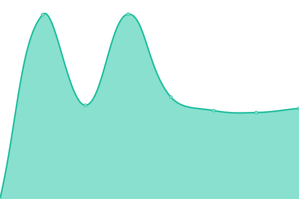
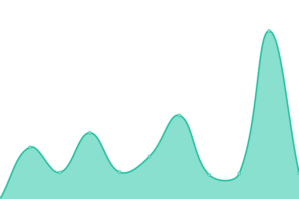

# [📈 Live Status](https://ilger03.github.io/Uptime): <!--live status--> **🟩 All systems operational**

This repository contains the open-source uptime monitor and status page for [ilger03](https://ilger03.github.io/Uptime), powered by [Upptime](https://github.com/upptime/upptime).

With [Upptime](https://upptime.js.org), you can get your own unlimited and free uptime monitor and status page, powered entirely by a GitHub repository. We use [Issues](https://github.com/ilger03/Uptime/issues) as incident reports, [Actions](https://github.com/ilger03/Uptime/actions) as uptime monitors, and [Pages](https://ilger03.github.io/Uptime) for the status page.

<!--start: status pages-->
<!-- This summary is generated by Upptime (https://github.com/upptime/upptime) -->
<!-- Do not edit this manually, your changes will be overwritten -->
<!-- prettier-ignore -->
| URL | Status | History | Response Time | Uptime |
| --- | ------ | ------- | ------------- | ------ |
|  GEOFIN1 | 🟩 Up | [geofin-1.yml](https://github.com/ilger03/Uptime/commits/HEAD/history/geofin-1.yml) | 

 763ms
     
 | 

<a href="https://ilger03.github.io/Uptime/history/geofin-1">100.00%</a>
    

|  WEB04_ZEUS | 🟩 Up | [web-04-zeus.yml](https://github.com/ilger03/Uptime/commits/HEAD/history/web-04-zeus.yml) | 

 471ms
     
 | 

<a href="https://ilger03.github.io/Uptime/history/web-04-zeus">100.00%</a>
    

|  HOSTING_WIN3 | 🟩 Up | [hosting-win-3.yml](https://github.com/ilger03/Uptime/commits/HEAD/history/hosting-win-3.yml) | 

 503ms
     
 | 

<a href="https://ilger03.github.io/Uptime/history/hosting-win-3">100.00%</a>
    

|  ZIM_LICENSE | 🟩 Up | [zim-license.yml](https://github.com/ilger03/Uptime/commits/HEAD/history/zim-license.yml) | 

 867ms
     
 | 

<a href="https://ilger03.github.io/Uptime/history/zim-license">100.00%</a>
    

|  CLOUDOFFICE01 | 🟩 Up | [cloudoffice-01.yml](https://github.com/ilger03/Uptime/commits/HEAD/history/cloudoffice-01.yml) | 

 872ms
     
 | 

<a href="https://ilger03.github.io/Uptime/history/cloudoffice-01">100.00%</a>
    

|  VCLOUD_HOTELTURIST | 🟩 Up | [vcloud-hotelturist.yml](https://github.com/ilger03/Uptime/commits/HEAD/history/vcloud-hotelturist.yml) | 

 507ms
     
 | 

<a href="https://ilger03.github.io/Uptime/history/vcloud-hotelturist">100.00%</a>
    

|  SMTP2_ILGER | 🟩 Up | [smtp-2-ilger.yml](https://github.com/ilger03/Uptime/commits/HEAD/history/smtp-2-ilger.yml) | 

 274ms
     
 | 

<a href="https://ilger03.github.io/Uptime/history/smtp-2-ilger">100.00%</a>
    

|  SMTP4_ILGER | 🟩 Up | [smtp-4-ilger.yml](https://github.com/ilger03/Uptime/commits/HEAD/history/smtp-4-ilger.yml) | 

 265ms
     
 | 

<a href="https://ilger03.github.io/Uptime/history/smtp-4-ilger">100.00%</a>
    

|  SMTP5_ILGER | 🟩 Up | [smtp-5-ilger.yml](https://github.com/ilger03/Uptime/commits/HEAD/history/smtp-5-ilger.yml) | 

 235ms
     
 | 

<a href="https://ilger03.github.io/Uptime/history/smtp-5-ilger">100.00%</a>
    

|  SMTP6_ILGER | 🟩 Up | [smtp-6-ilger.yml](https://github.com/ilger03/Uptime/commits/HEAD/history/smtp-6-ilger.yml) | 

 214ms
     
 | 

<a href="https://ilger03.github.io/Uptime/history/smtp-6-ilger">100.00%</a>
    

|  SMTPMEDICASA | 🟩 Up | [smtpmedicasa.yml](https://github.com/ilger03/Uptime/commits/HEAD/history/smtpmedicasa.yml) | 

 215ms
     
 | 

<a href="https://ilger03.github.io/Uptime/history/smtpmedicasa">100.00%</a>
    

|  WPZADMIN7 | 🟩 Up | [wpzadmin-7.yml](https://github.com/ilger03/Uptime/commits/HEAD/history/wpzadmin-7.yml) | 

 983ms
     
 | 

<a href="https://ilger03.github.io/Uptime/history/wpzadmin-7">100.00%</a>
    

|  HOSTING5_ILGER | 🟩 Up | [hosting-5-ilger.yml](https://github.com/ilger03/Uptime/commits/HEAD/history/hosting-5-ilger.yml) | 

 1036ms
     
 | 

<a href="https://ilger03.github.io/Uptime/history/hosting-5-ilger">100.00%</a>
    

|  HOSTING6_ILGER | 🟩 Up | [hosting-6-ilger.yml](https://github.com/ilger03/Uptime/commits/HEAD/history/hosting-6-ilger.yml) | 

 487ms
     
 | 

<a href="https://ilger03.github.io/Uptime/history/hosting-6-ilger">100.00%</a>
    

|  HOSTING7_ILGER | 🟩 Up | [hosting-7-ilger.yml](https://github.com/ilger03/Uptime/commits/HEAD/history/hosting-7-ilger.yml) | 

 494ms
     
 | 

<a href="https://ilger03.github.io/Uptime/history/hosting-7-ilger">100.00%</a>
    

|  WEB06_ZEUS | 🟩 Up | [web-06-zeus.yml](https://github.com/ilger03/Uptime/commits/HEAD/history/web-06-zeus.yml) | 

 771ms
     
 | 

<a href="https://ilger03.github.io/Uptime/history/web-06-zeus">100.00%</a>
    

|  FOTI1_ILGER | 🟩 Up | [foti-1-ilger.yml](https://github.com/ilger03/Uptime/commits/HEAD/history/foti-1-ilger.yml) | 

 467ms
     
 | 

<a href="https://ilger03.github.io/Uptime/history/foti-1-ilger">100.00%</a>
    

|  FOTI2_ILGER | 🟩 Up | [foti-2-ilger.yml](https://github.com/ilger03/Uptime/commits/HEAD/history/foti-2-ilger.yml) | 

 923ms
     
 | 

<a href="https://ilger03.github.io/Uptime/history/foti-2-ilger">100.00%</a>
    

|  ECOLINEWASH3 | 🟩 Up | [ecolinewash-3.yml](https://github.com/ilger03/Uptime/commits/HEAD/history/ecolinewash-3.yml) | 

 3659ms
     
 | 

<a href="https://ilger03.github.io/Uptime/history/ecolinewash-3">100.00%</a>
    

|  LACASADELFORMAGGIO | 🟩 Up | [lacasadelformaggio.yml](https://github.com/ilger03/Uptime/commits/HEAD/history/lacasadelformaggio.yml) | 

 1486ms
     
 | 

<a href="https://ilger03.github.io/Uptime/history/lacasadelformaggio">100.00%</a>
    

<!--end: status pages-->

[**Visit our status website →**](https://ilger03.github.io/Uptime)

## 📄 License

- Powered by: [Upptime](https://github.com/upptime/upptime)
- Code: [MIT](./LICENSE) © [ilger03](https://ilger03.github.io/Uptime)
- Data in the `./history` directory: [Open Database License](https://opendatacommons.org/licenses/odbl/1-0/)
